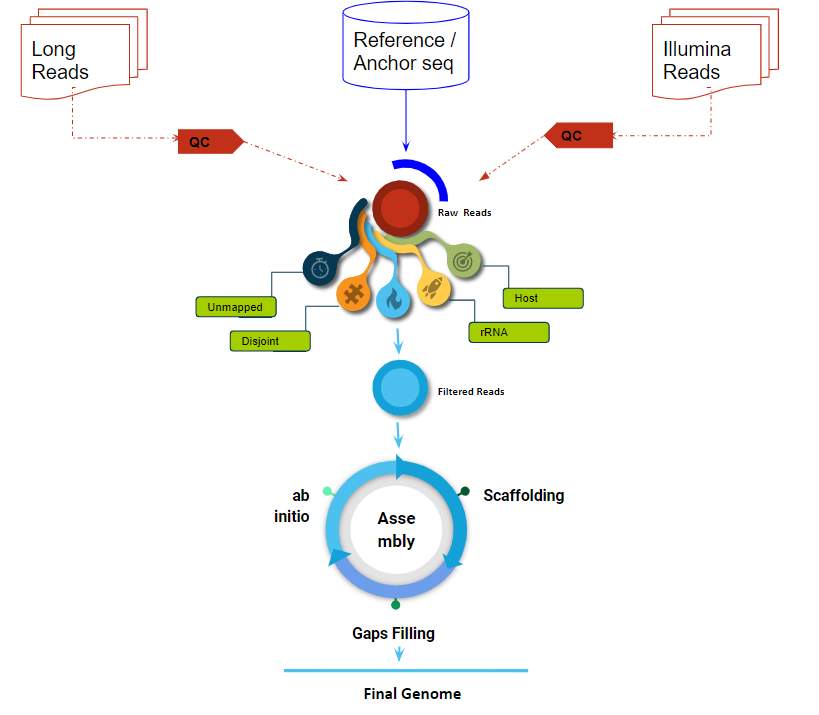

[](https://github.com/jnarayan81/setu/graphs/code-frequency)

[](https://www.gnu.org/software/bash/)
[](https://lbesson.mit-license.org/)
![Safe](https://img.shields.io/badge/Stay-Safe-red?logo=data:image/svg%2bxml;base64,PHN2ZyBpZD0iTGF5ZXJfMSIgZW5hYmxlLWJhY2tncm91bmQ9Im5ldyAwIDAgNTEwIDUxMCIgaGVpZ2h0PSI1MTIiIHZpZXdCb3g9IjAgMCA1MTAgNTEwIiB3aWR0aD0iNTEyIiB4bWxucz0iaHR0cDovL3d3dy53My5vcmcvMjAwMC9zdmciPjxnPjxnPjxwYXRoIGQ9Im0xNzQuNjEgMzAwYy0yMC41OCAwLTQwLjU2IDYuOTUtNTYuNjkgMTkuNzJsLTExMC4wOSA4NS43OTd2MTA0LjQ4M2g1My41MjlsNzYuNDcxLTY1aDEyNi44MnYtMTQ1eiIgZmlsbD0iI2ZmZGRjZSIvPjwvZz48cGF0aCBkPSJtNTAyLjE3IDI4NC43MmMwIDguOTUtMy42IDE3Ljg5LTEwLjc4IDI0LjQ2bC0xNDguNTYgMTM1LjgyaC03OC4xOHYtODVoNjguMThsMTE0LjM0LTEwMC4yMWMxMi44Mi0xMS4yMyAzMi4wNi0xMC45MiA0NC41LjczIDcgNi41NSAxMC41IDE1LjM4IDEwLjUgMjQuMnoiIGZpbGw9IiNmZmNjYmQiLz48cGF0aCBkPSJtMzMyLjgzIDM0OS42M3YxMC4zN2gtNjguMTh2LTYwaDE4LjU1YzI3LjQxIDAgNDkuNjMgMjIuMjIgNDkuNjMgNDkuNjN6IiBmaWxsPSIjZmZjY2JkIi8+PHBhdGggZD0ibTM5OS44IDc3LjN2OC4wMWMwIDIwLjY1LTguMDQgNDAuMDctMjIuNjQgNTQuNjdsLTExMi41MSAxMTIuNTF2LTIyNi42NmwzLjE4LTMuMTljMTQuNi0xNC42IDM0LjAyLTIyLjY0IDU0LjY3LTIyLjY0IDQyLjYyIDAgNzcuMyAzNC42OCA3Ny4zIDc3LjN6IiBmaWxsPSIjZDAwMDUwIi8+PHBhdGggZD0ibTI2NC42NSAyNS44M3YyMjYuNjZsLTExMi41MS0xMTIuNTFjLTE0LjYtMTQuNi0yMi42NC0zNC4wMi0yMi42NC01NC42N3YtOC4wMWMwLTQyLjYyIDM0LjY4LTc3LjMgNzcuMy03Ny4zIDIwLjY1IDAgNDAuMDYgOC4wNCA1NC42NiAyMi42NHoiIGZpbGw9IiNmZjRhNGEiLz48cGF0aCBkPSJtMjEyLjgzIDM2MC4xMnYzMGg1MS44MnYtMzB6IiBmaWxsPSIjZmZjY2JkIi8+PHBhdGggZD0ibTI2NC42NSAzNjAuMTJ2MzBoMzYuMTRsMzIuMDQtMzB6IiBmaWxsPSIjZmZiZGE5Ii8+PC9nPjwvc3ZnPg==)


# Setu
Setu: A pipeline for robust assembly of the SARS-CoV-2 genome.

Setu (sanskrit सेतु) means bridge. It bridges all the reads to genome.
```
______ _____/  |_ __ __ 
 /  ___// __ \   __\  |  \
 \___ \\  ___/|  | |  |  /
/____  >\___  >__| |____/ v0.1
     \/     \/ bridging the SARS-CoV-2 genome 
```
# Getting Started
## Installation
Clone the repository using git:
```
git clone https://github.com/jnarayan81/setu.git
``` 
## Dependencies
Required dependencies can be installed in a separate conda environment named **setu** through:
```
cd setu
conda create -f env_setu.yml
```
Setu requires the following dependencies to be installed:
 - Python 3.7
 - Trimmomatic
 - BWA-MEM
 - Samtools
 - Bedtools
 - Spades
 - Ragout
 - QUAST
 - R >=3.6.0
   - Reshape package 
 
 Alternatively, all dependencies can be installed through Conda.
 
 ## Usage
 Setu supports only paired-end Illumina reads at the moment, work on long-reads, command is as follows:
 
 **Paired-end reads:**
 ```
 ./setu.sh -k yes -m pe -t 1 -r paired_1.fastq,paired_2.fastq -f on -o OutputDirectory
 ```
 Please note that there's no space after the comma when specifying reads using the `-r` flag.
 
 Assembly of single-end and hybrid-reads is currently ongoing and will be updated.
 
 ## Testing
 You can test your installation by running:
 ```
 ./test_run.sh
 ```
<h2>Setu: A Pipeline for the robust Assembling of the SARS-CoV-2 Genome</h2>

**Setu**: A pipeline for robust assembly of the SARS-CoV-2 genome. It has three mode of genome assembly: 1. Paired-End 2. Hybrid 3. Long reads. 

The promise of setu:

* Implement recent NGS techniques to achieve reliable genome assembly.
* Maintain flexibility in reads type selection.
* Build on standard Conda and Python packages.

In a nutshell, this pipeline is intended to use all types of NGS reads to generate a genome of high quality. 

Consult Jitendra Narayan at jnarayan81@gmail.com or info@bioinformaticsonline.com for any support.

# Introduction

The Severe Acute Respiratory Syndrome Coronavirus 2 (SARS-CoV-2) is a new Betacoronavirus strain that infects humans. This disease is the cause of the ongoing Coronavirus Disease (CoViD2019) pandemic. Because of the rapid innovation and decreasing prices of high throughput sequencing technologies, the virus has been sequenced internationally in a large number of people who have been infected. While next-generation sequencing (NGS) technology provides a reliable method of identifying potential infections in clinical specimens, simple and user-friendly bioinformatics workflows are necessary to acquire a complete viral genome sequence with the greatest accuracy. We have developed a thorough workflow for evaluating and decoding SARS-CoV 2 sequencing data using open source technologies. It entails complete sequence elimination of host- or bacteria-related NGS reads prior to de novo assembly, resulting in the quick and accurate assembly of viral genome metagenomic sequences.

# Flowchart 
Illustrating procedures for assembly of the SARS-CoV-2 genome.



# News

**June 1, 2021:** Release v0.1, see release notes [here](http://bioinformaticsonline.com/setu)

# Blogs and Publications

* June 2020: [CoViD Assembler](http://bioinformaticsonline.com/setu)

# Citation

If you use setu in your research, please cite us as follows:

   Jitendra Narayan¹*, Nityendra Shukla¹, Suyash Agarwal², Neha Srivastava³, Prekshi Garg³, Prachi Srivastava³* **Setu: A Pipeline for the robust Assembling of the SARS-CoV-2 Genome** https://github.com/jnarayan81/setu, 2020. Version 0.1

BibTex:

```
@misc{setu,
  author={Jitendra Narayan¹*, Nityendra Shukla¹, Suyash Agarwal², Neha Srivastava³, Prekshi Garg³, Prachi Srivastava³*}
  title={{Setu}: {A Pipeline for the robust Assembling of the SARS-CoV-2 Genome}},
  howpublished={https://github.com/jnarayan81/setu},
  note={Version 0.1},
  year={2021}
}
```

# Contributing and Feedback

This project welcomes contributions and suggestions.

For more information contact [jnarayan81@gmail.com](mailto:jnarayan81@gmail.com) or (mailto:info@bioinformaticsonline.com) with any additional questions or comments.
